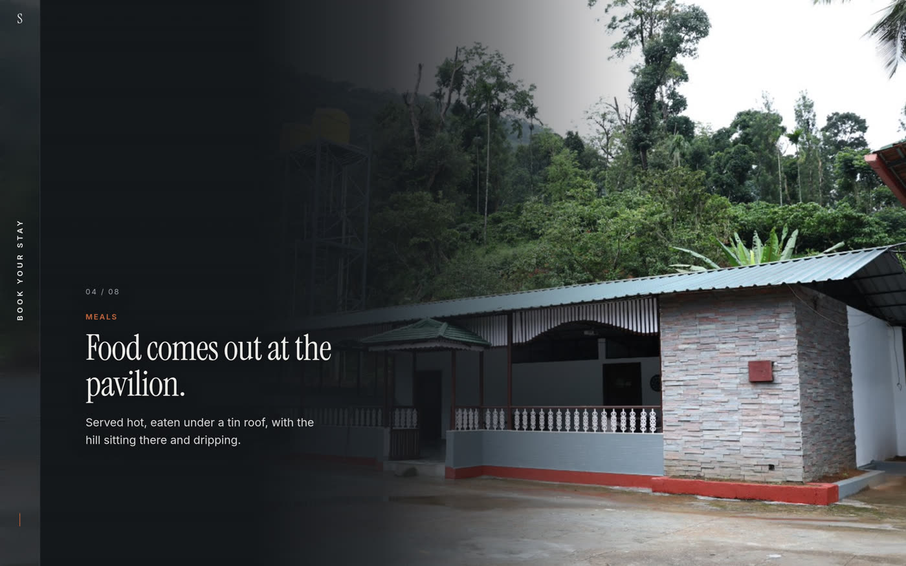
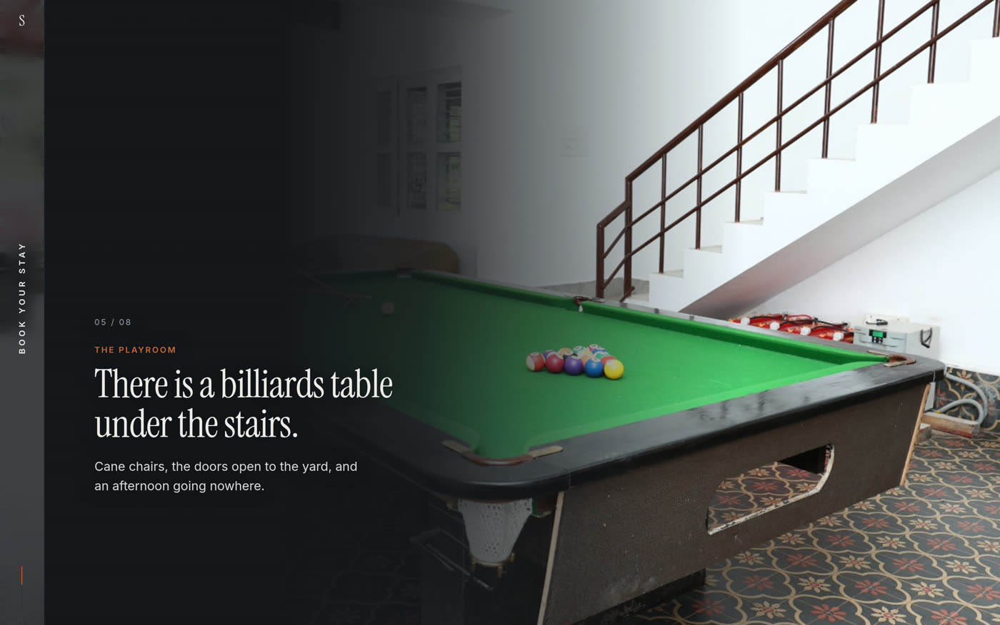
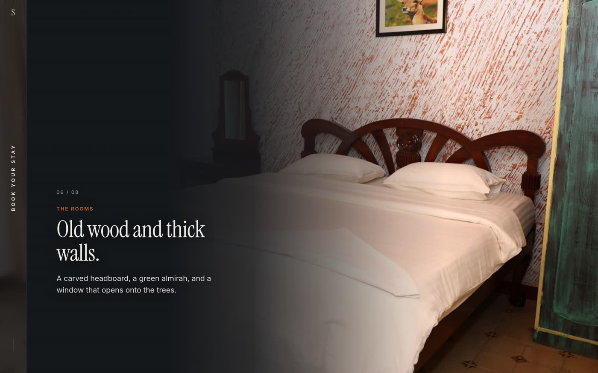
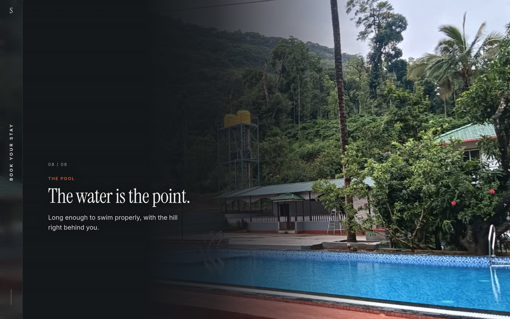
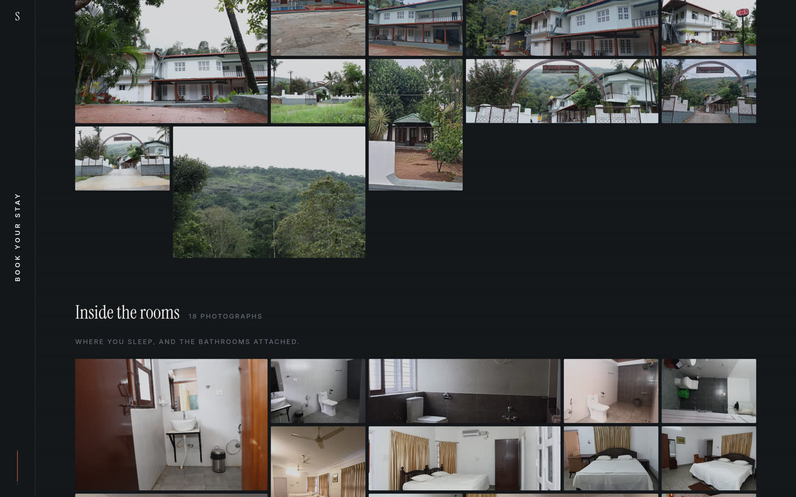
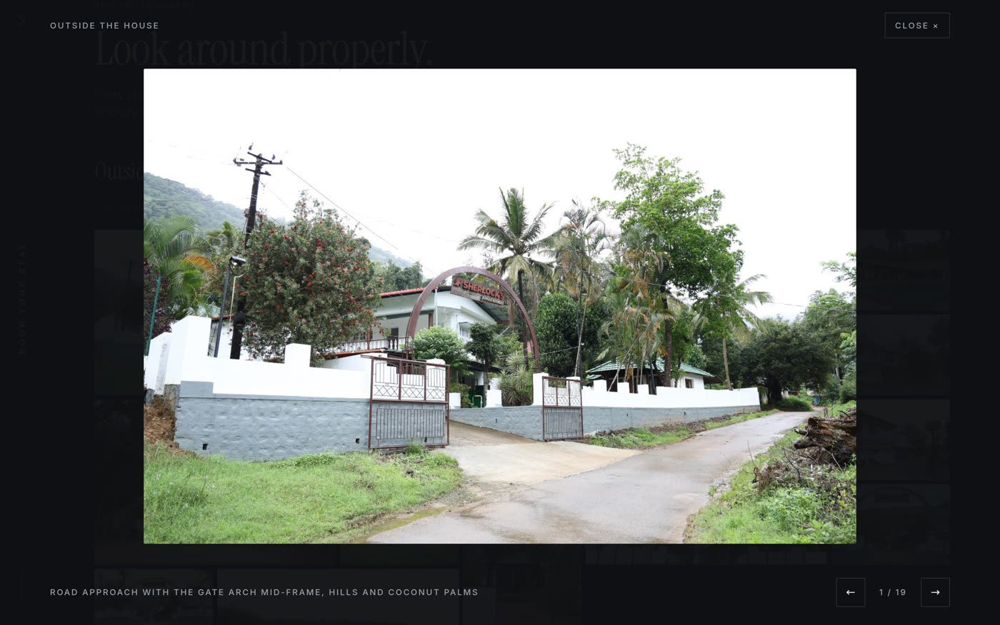
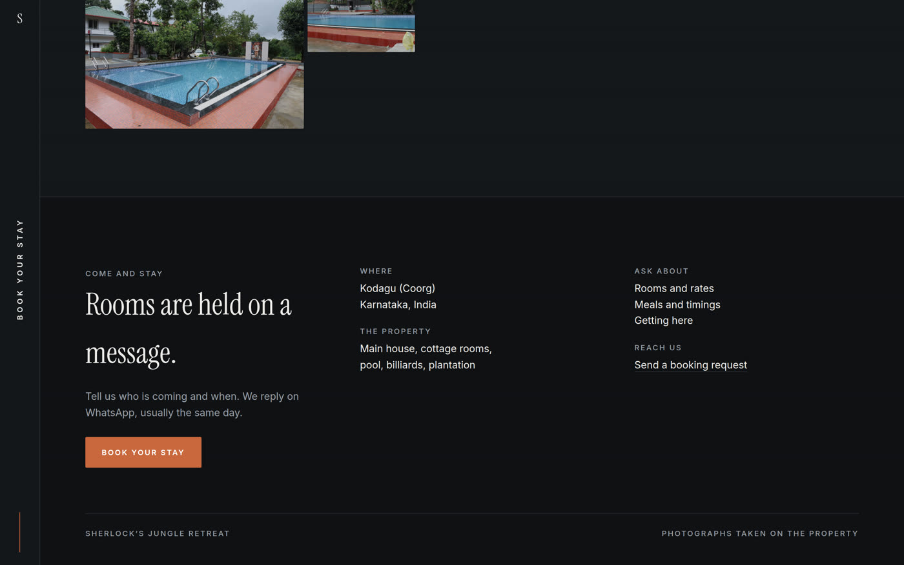
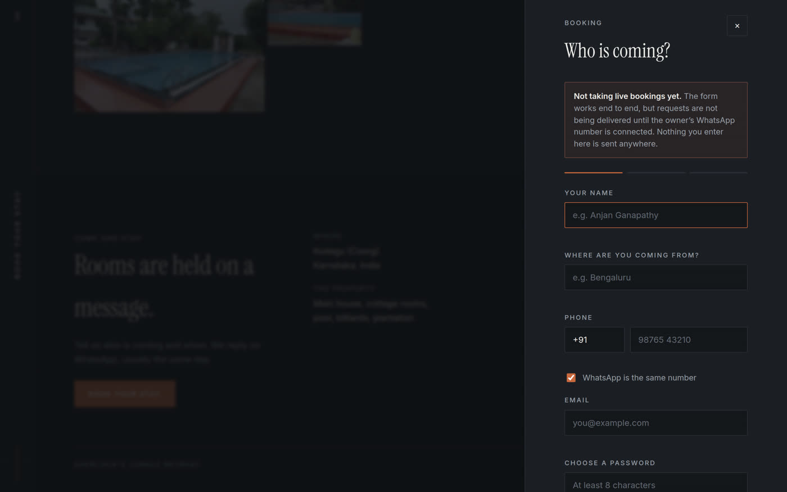
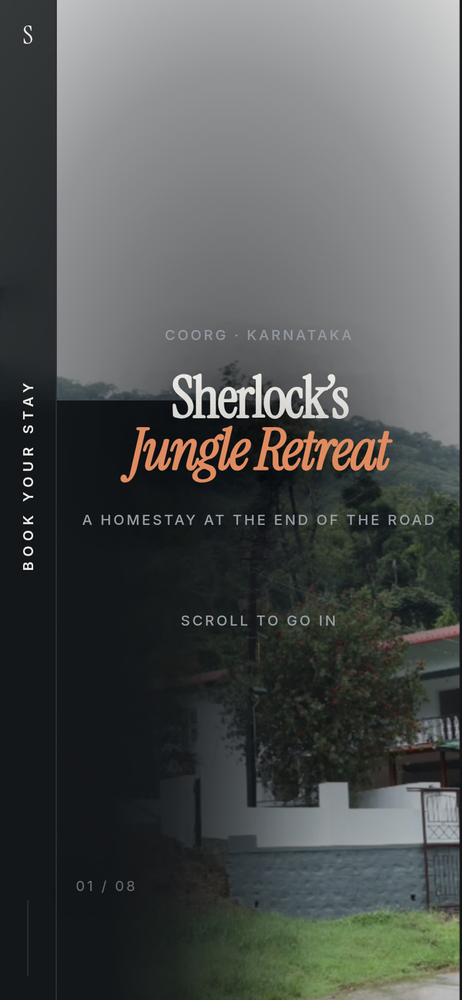

# Sherlock's Jungle Retreat

A scroll-driven site for a homestay in Coorg (Kodagu), Karnataka. Scroll drives a
camera, not a scrollbar: it comes up the road, passes under the arch, crosses the
courtyard, sits down to a meal, plays a frame of billiards, looks into a room and
its bathroom, and comes out at the pool.


Static and framework-free — plain HTML, one vanilla-JS engine, no build step, no
dependencies. Serve the repo over HTTP and open `/web/`.

```bash
python3 -m http.server 8765
# http://localhost:8765/web/index.html
```

## The walkthrough

Eight beats, chained as one continuous forward journey.

| | |
|---|---|
|  |  |
| **The arch.** The name dissolves as the camera goes in. | **The table.** Where the buffet is laid. |
|  |  |
| **The playroom**, halfway down the scroll. | **The rooms.** Old wood, thick walls. |



The story is told in two type registers and nothing between them: a large
editorial serif for anything that carries meaning, a small tracked sans for
anything that labels. That gap is the whole system — a third size in the middle is
what makes a page read as generated, so there isn't one.

## The photographs

Past the last beat the camera dissolves into a tiled gallery of all 47
photographs, in three groups: outside the house, inside the rooms, and the pool
and playroom.



Click any tile and it opens into a horizontal carousel across that group —
arrow keys, swipe, `Esc` to close.



## Booking

A booking rail rides the left edge for the entire scroll, from the first frame to
the footer. It opens a three-step request: who is coming, a code to their phone,
and confirmation.

| | |
|---|---|
|  |  |

**Booking is deliberately inert.** The form works end to end against a mock, and
says plainly on its face that requests are not being delivered yet. Switching it
on is filling `api/config.php` with the owner's WhatsApp credentials and setting
one flag — see [docs/DEPLOY-hostinger.md](docs/DEPLOY-hostinger.md). Nothing
pretends to have accepted a booking it did not.

## On a phone



The rail stays on the left, the copy clears it, and the type scales down with the
viewport. No horizontal overflow at 360px through 2560px.

## Layout

| Path | What |
|---|---|
| `web/` | the page, its config, the CSS, the JS, self-hosted fonts |
| `web/scrub-engine.js` | the scroll-scrub engine, byte-identical to the `scroll-world` skill |
| `assets/raw/` | 47 property photographs, named for what they show |
| `assets/scenes/` | the 8 walkthrough canvases, exactly 1920×1080 |
| `assets/manifest.json` | every image: dimensions, category, gallery group, scene role |
| `api/` | the booking endpoint for Hostinger, inert until configured |
| `render/` | the Higgsfield chain — written, costed, **not run** |
| `docs/` | deployment guide and these screenshots |

## The video chain

Today every beat holds a still. The camera moves because the engine scrubs, not
because there is video yet.

`render/` carries the whole chain ready to fire: eight leg prompts sharing one
byte-identical style preamble, two masked inpaints (the bathroom, and a buffet
laid on the pavilion table), the run book, and the encode scripts. It has not
been run — the Higgsfield account reads **0 credits on a free plan**.

**Estimated cost of the full build: ≈610–805 credits** across 19 generations.
`render/COSTS.md` has the breakdown, and two ways it could cost much less: both
models report `supports_unlim: true`, so a plan with unlimited generations active
would make it free; and a full previz pass on `seedance_2_0_mini` runs about a
quarter of the price.

When the clips land, each beat takes one added line in `web/world.config.js` and
nothing else changes.

## A note on the name

The property is signed **Sherlock's Jungle Retreat** at its gate, which is what
the site uses. The repository is still named `benaka-homestay`.
