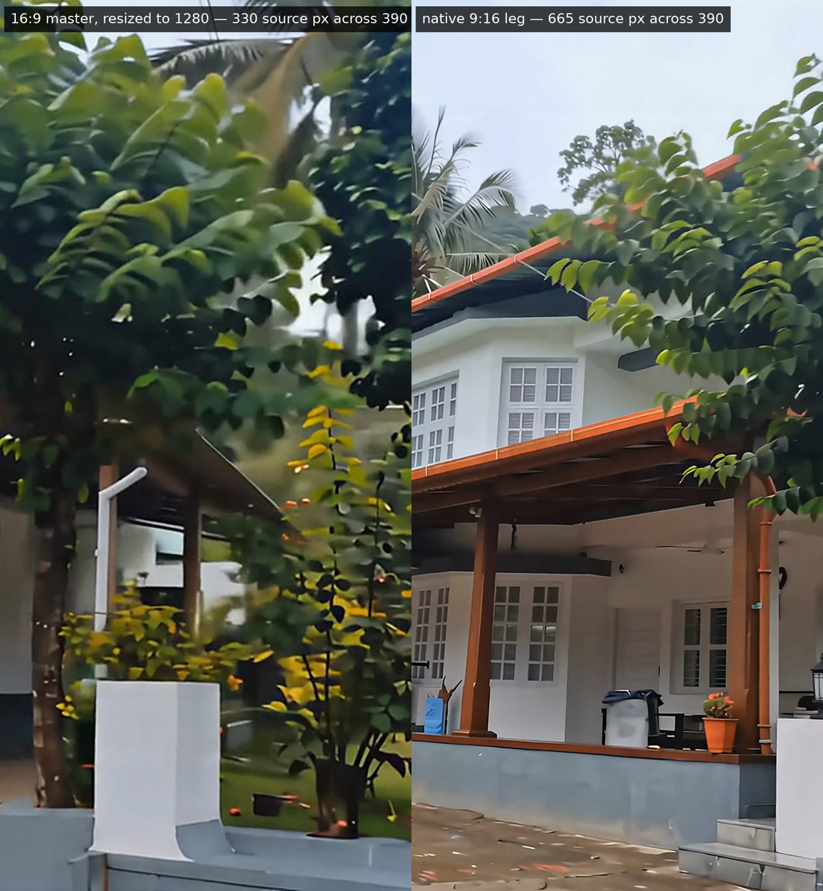

# Benaka By The Hills

A scroll-driven site for a homestay in Coorg (Kodagu), Karnataka. Scroll drives a
camera, not a scrollbar: it comes up the road, passes under the arch, runs the
length of the verandah, crosses to the pavilion where meals are served, goes on
through the billiards game, into a room, and out at the pool.


Static and framework-free — plain HTML, one vanilla-JS engine, no build step, no
dependencies. Serve the repo over HTTP and open `/web/`.

```bash
php -S localhost:8765 -t .
# http://localhost:8765/   — the root index.html sends you to the site
```

**`php -S`, not `python3 -m http.server`.** The static server cannot execute
`api/booking.php`, so the booking form would silently stay in preview and the
endpoint would never be exercised.

```bash
bash tools/test.sh   # the full suite: syntax, secrets, assets, and the live API
```

The site itself lives in `web/`. The root `index.html` is a small redirect so
that opening the repository root gives the homestay rather than a directory
listing. On Hostinger it is never reached: `.htaccess` maps `/` to
`web/index.html` internally, so visitors get a clean `/` with no hop.

## The walkthrough

Seven beats, chained as one continuous forward journey: the road, the arch, the
house, the table, the playroom, a room, the pool.

| | |
|---|---|
|  |  |
| **The gate.** In under the arch, up to the house. | **The pavilion.** Served here, then in through the doors. |
|  |  |
| **The playroom.** Past the table, through to the rooms. | **The rooms.** Out of the room and down to the water. |

Each line names the journey its leg travels, not the place it starts from —
every leg runs beat N to beat N+1, and copy that named only the start left the
whole story reading half a beat behind the picture.


The story is told in two type registers and nothing between them: a large
editorial serif for anything that carries meaning, a small tracked sans for
anything that labels. That gap is the whole system — a third size in the middle is
what makes a page read as generated, so there isn't one.

**Nothing is laid over the photographs** — no shadow, no glow, no scrim, no
gradient. Instead each beat places its copy where the picture is already dark,
measured rather than guessed, by `tools/measure-copy-zones.py`: the browser's own
`object-fit: cover` crop, four moments sampled across the leg, and every zone
scored by its **worst** one. Measured against the moving clips, not the stills —
a spot that is dark on the poster can be a white wall four seconds in.

Each chain has one beat with nowhere dark at all. On the landscape chain it is
the lit games room; on the portrait chain it is the white bedding and pale lime
wall of the room. Both flip the ink to dark rather than put a shade over the
photograph.

## The photographs

Past the last beat the camera dissolves into a tiled gallery of all 47
photographs. The three groups — outside the house, inside the rooms, pool and
playroom — sit side by side as a single block rather than stacked, so the whole
library reads at a glance.


Click any tile and it opens into a horizontal carousel across that group —
arrow keys, swipe, `Esc` to close.


## Booking

A compact BOOK button stays fixed to the left edge for the entire scroll, from
the first frame to the footer — a small persistent control, not a sidebar. It
expands to BOOK YOUR STAY on hover and opens a three-step request: who is
coming, a code to their phone, and confirmation.

| | |
|---|---|
|  |  |

**The server decides whether booking is live, not the JavaScript.** On load the
page asks `api/booking.php` for its status. With no `api/config.php` it answers
`live: false`, the page runs a local preview, and the panel says plainly that
nothing is being delivered. Put a filled config on the server and the same page
goes live — no source edit, no build step, no flag anyone can forget to flip.

**Every WhatsApp message is an approved template.** Both messages the site sends
are business-initiated, and Meta rejects free-form text outside the 24-hour
window — worse, sending a verification code as free text is grounds for
suspending the account. The guest's code goes out as an **authentication**
template with a copy-code button; the owner's notification as a **utility**
template with six fields. Setting up both is
[docs/DEPLOY-hostinger.md](docs/DEPLOY-hostinger.md) §3.

**The request carries dates, and reaches both owners.** Arrival and departure
are asked for in the form, checked in the browser and again on the server, and
travel to WhatsApp as one single-line parameter. The notification goes to every
number on the owner list, each send recorded separately, so one unreachable
phone cannot lose a booking for the other.

**A request is never lost and never oversold.** The record is written to disk
before the send is attempted, and the guest is told which of four things
happened: received and delivered, received but delivery failed, received but
delivery is switched off, or the system is unreachable. Nothing claims a booking
was delivered that was not.

**No accounts, no passwords.** The form asks for a name, where you are coming
from, a phone number, a WhatsApp number and an email. There is nothing else to
store and nothing to leak.

## Where it is


The last block on the page: the name at the size it deserves, **Near Irpu Falls,
Kodagu**, both numbers as tap-to-call, and one button out to Google Maps. Not an
embedded map — an iframe would need google.com in the Content-Security-Policy
and would set third-party cookies on a site that has neither, and on a phone a
plain link opens the visitor's own map app anyway.

## On a phone


Phones get the portrait chain, their own measured copy placement, and a longer
scroll per beat so no frame is skipped. The button stays on the left, the copy
clears it, and the type scales down with the viewport. No horizontal overflow at
360px through 2560px.

## Layout

| Path | What |
|---|---|
| `web/` | the page, its config, the CSS, the JS, self-hosted fonts |
| `web/scrub-engine.js` | the scroll-scrub engine, byte-identical to the `scroll-world` skill |
| `assets/raw/` | 47 property photographs, named for what they show |
| `assets/scenes/` | the 7 walkthrough canvases, exactly 1920×1080 |
| `render/prompts/canvas/` | how the two BENAKA arch canvases were made, and the trap in remaking them |
| `assets/scenes/portrait/` | the same 7 beats at 1080×1920, anchoring the phone chain |
| `assets/clips/` | 14 rendered legs — `leg-0N.mp4` landscape, `leg-0N-m.mp4` portrait |
| `assets/manifest.json` | every image: dimensions, category, gallery group, scene role |
| `api/` | the booking endpoint for Hostinger, inert until configured |
| `tools/test.sh` | the production suite — php, node, curl, jq; no framework |
| `render/` | the OpenArt render chain: prompts, run book, costs, encoders |
| `docs/` | deployment guide and these screenshots |

## The walkthrough is rendered


Seven 8-second legs at 1080p, rendered on **OpenArt / PixVerse V6** from the
property's own photographs. One continuous forward journey: up the road, under
the arch, across the courtyard, past a buffet being served, through the billiards
game, into a room, and out to the pool for the last splash.

Each leg begins on the **actual last frame of the leg before it**, so the seams
are frame-exact rather than cut — measured at 30.3 dB on the first handoff. Each
also carries an **end frame** naming the next beat, which is what makes the
journey provably visit all seven places; without it a single 5-second clip
crossed three beats and would never have reached the room or the pool.

Cost: **1,512 credits** for the seven legs, plus 90 on two probes that proved the
mechanism before committing — **1,602 of a 12,000 balance**. `render/COSTS.md`
records the per-leg maths and why Seedance 2.0 was ruled out at eight times the
price.

## Phones get their own chain

A 16:9 clip on a 390×844 phone is cropped by `object-fit: cover` to **25.8% of
its width**, and the mobile encode used to resize the master to 1280 wide on top
of that — cover's scale factor there is 1.18, an *upscale*, so 330 source pixels
were being stretched across 390 CSS pixels. The phone build was softer than the
desktop master it came from, and no encoder setting could fix it: the framing was
never rendered.

So the phone gets a **second, native 9:16 chain** — the same seven beats, the
same journey, rendered portrait. It shows **82% of the frame** and puts **887
source pixels** where 330 used to go. Same 216 credits a leg; a 45-credit probe
confirmed PixVerse takes its aspect from the start frame before the chain was
committed.



Desktop gets the 1080p landscape masters; phones get the portrait legs at
810×1440 with a tighter GOP, and a portrait poster to match, all served
automatically by the engine. The stills remain the posters and the
reduced-motion fallback.

## A note on the name

The property is signed **Benaka By The Hills** at its gate, which is what
the site uses. The repository is still named `benaka-homestay`.
