# Sherlock's Jungle Retreat

A scroll-driven site for a homestay in Coorg (Kodagu), Karnataka. Scroll drives a
camera, not a scrollbar: it comes up the road, passes under the arch, crosses the
courtyard, sits down to a meal, plays a frame of billiards, looks into a room and
its bathroom, and comes out at the pool.

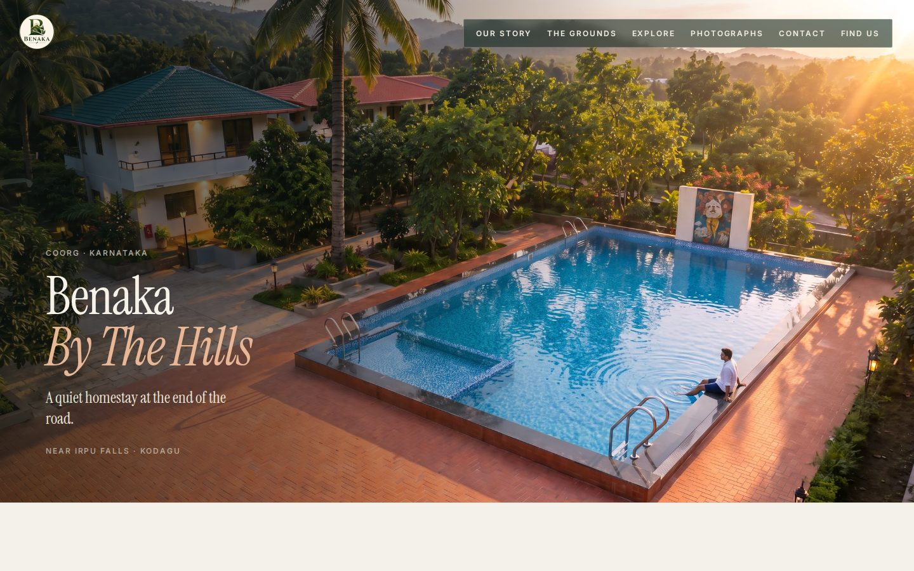

Static and framework-free — plain HTML, one vanilla-JS engine, no build step, no
dependencies. Serve the repo over HTTP and open `/web/`.

```bash
python3 -m http.server 8765
# http://localhost:8765/   — the root index.html sends you to the site
```

The site itself lives in `web/`. The root `index.html` is a small redirect so
that opening the repository root gives the homestay rather than a directory
listing. On Hostinger it is never reached: `.htaccess` maps `/` to
`web/index.html` internally, so visitors get a clean `/` with no hop.

## The walkthrough

Seven beats, chained as one continuous forward journey: the road, the arch, the
house, the table, the playroom, a room, the pool.

| | |
|---|---|
| 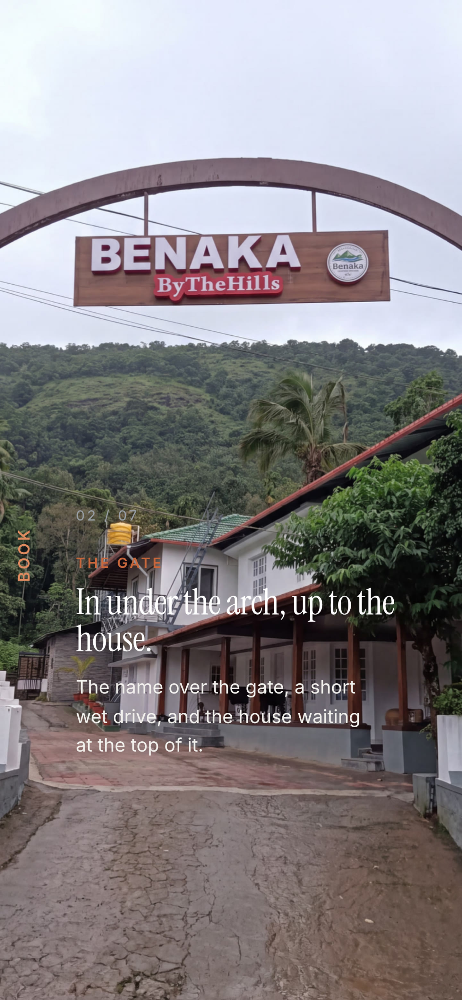 | 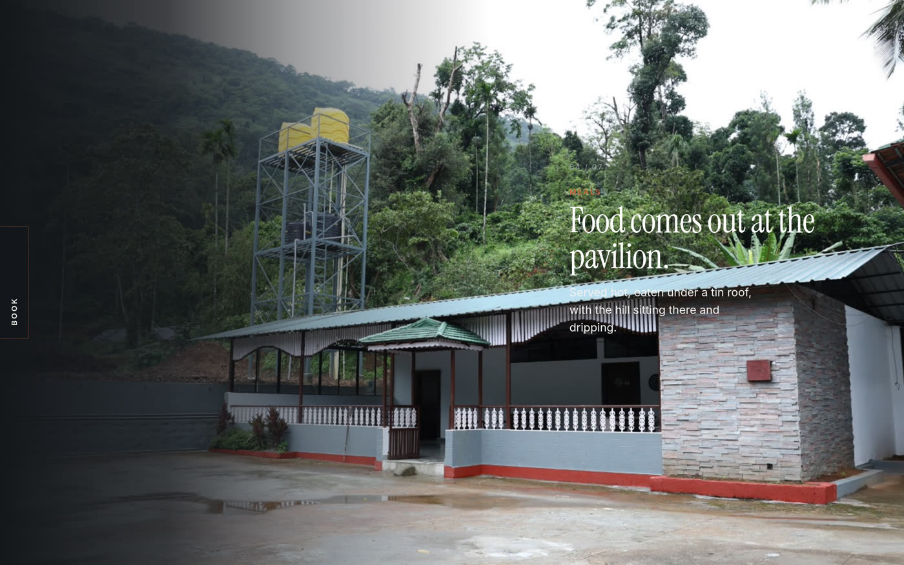 |
| **The arch.** The name dissolves as the camera goes in. | **The table.** Where the buffet is laid. |
| 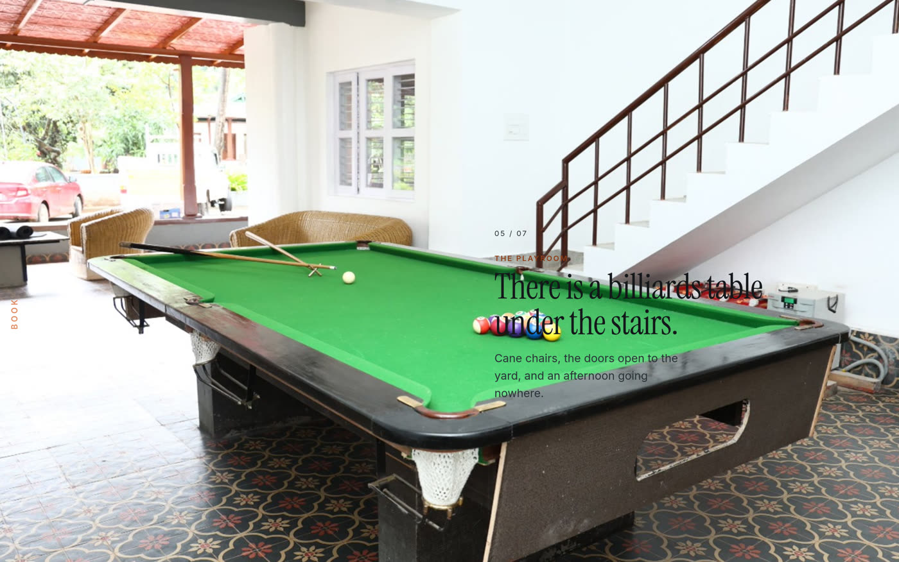 | 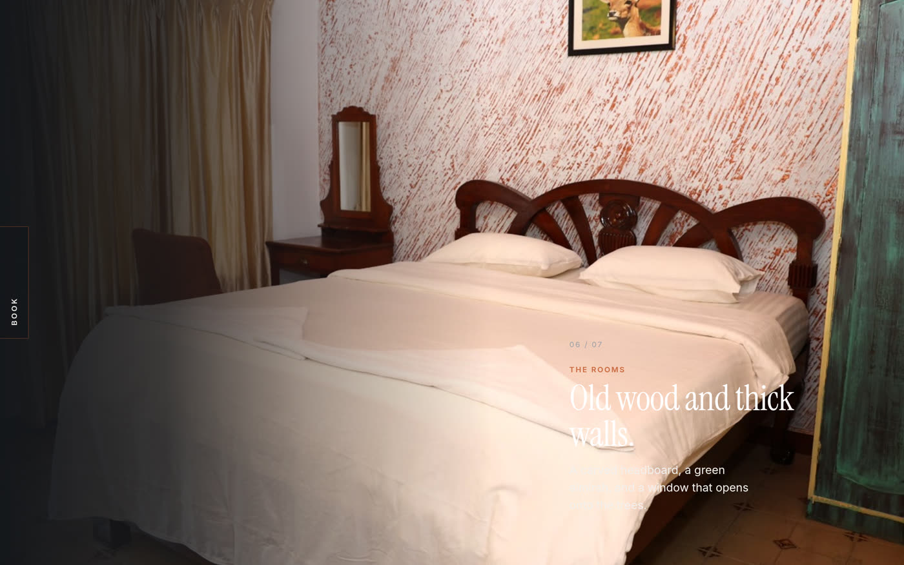 |
| **The playroom**, halfway down the scroll. | **The rooms.** Old wood, thick walls. |

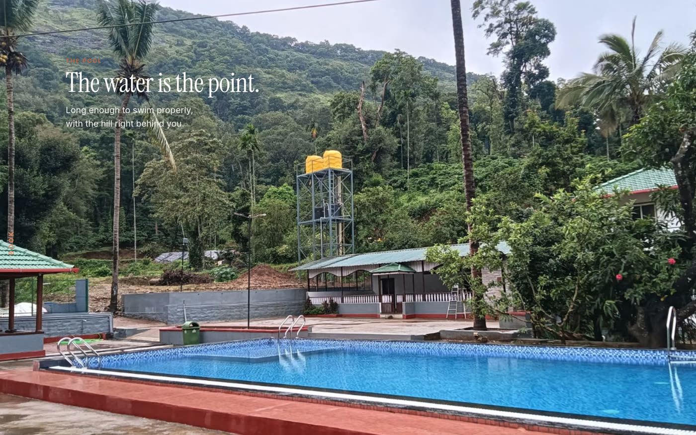

The story is told in two type registers and nothing between them: a large
editorial serif for anything that carries meaning, a small tracked sans for
anything that labels. That gap is the whole system — a third size in the middle is
what makes a page read as generated, so there isn't one.

**Nothing is laid over the photographs** — no shadow, no glow, no scrim, no
gradient. Instead each beat places its copy where that photograph is already
dark, measured rather than guessed: mean luminance of the copy block sampled on
a grid over every canvas, darkest position wins. Three beats are bright down
their whole left side, so their copy sits right or centre, and the alternation
reads as rhythm.

## The photographs

Past the last beat the camera dissolves into a tiled gallery of all 47
photographs. The three groups — outside the house, inside the rooms, pool and
playroom — sit side by side as a single block rather than stacked, so the whole
library reads at a glance.

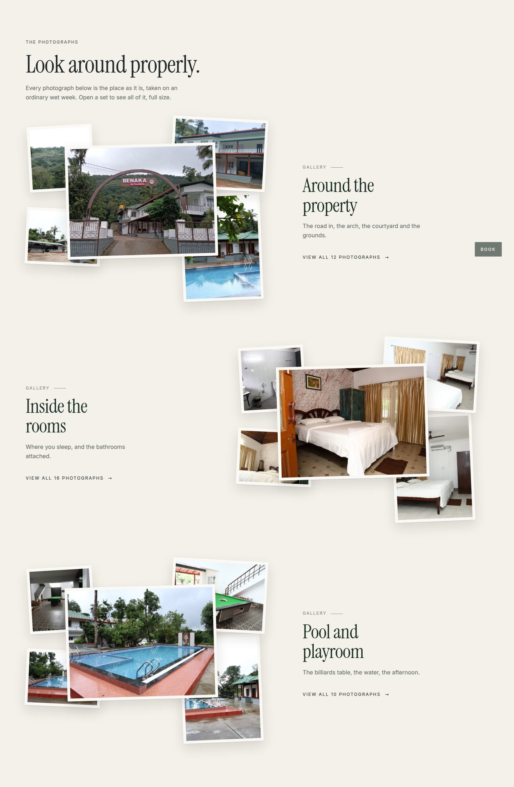

Click any tile and it opens into a horizontal carousel across that group —
arrow keys, swipe, `Esc` to close.

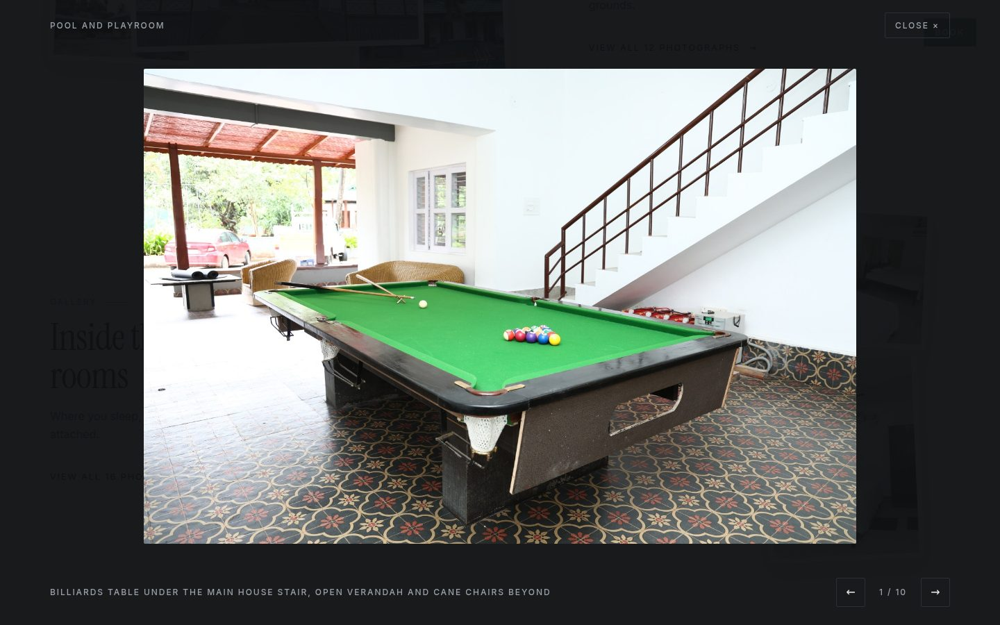

## Booking

A compact BOOK button stays fixed to the left edge for the entire scroll, from
the first frame to the footer — a small persistent control, not a sidebar. It
expands to BOOK YOUR STAY on hover and opens a three-step request: who is
coming, a code to their phone, and confirmation.

| | |
|---|---|
| 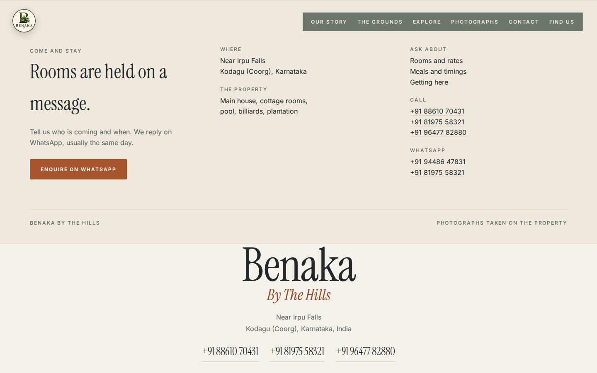 | 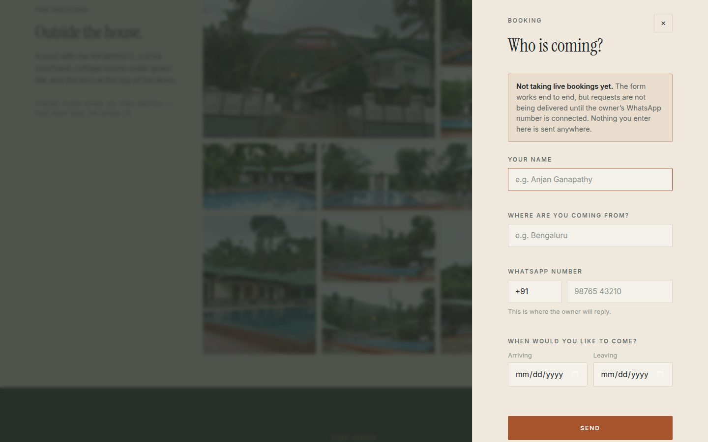 |

**Booking is deliberately inert.** The form works end to end against a mock, and
says plainly on its face that requests are not being delivered yet. Switching it
on is filling `api/config.php` with the owner's WhatsApp credentials and setting
one flag — see [docs/DEPLOY-hostinger.md](docs/DEPLOY-hostinger.md). Nothing
pretends to have accepted a booking it did not.

## On a phone

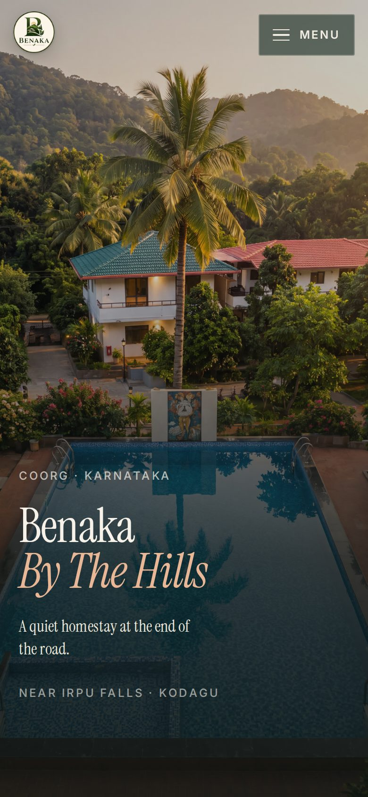

The button stays on the left, the copy clears it, and the type scales down with
the viewport. No horizontal overflow at 360px through 2560px.

## Layout

| Path | What |
|---|---|
| `web/` | the page, its config, the CSS, the JS, self-hosted fonts |
| `web/scrub-engine.js` | the scroll-scrub engine, byte-identical to the `scroll-world` skill |
| `assets/raw/` | 47 property photographs, named for what they show |
| `assets/scenes/` | the 7 walkthrough canvases, exactly 1920×1080 |
| `assets/manifest.json` | every image: dimensions, category, gallery group, scene role |
| `api/` | the booking endpoint for Hostinger, inert until configured |
| `render/` | the Higgsfield chain — written, costed, **not run** |
| `docs/` | deployment guide and these screenshots |

## The walkthrough is rendered

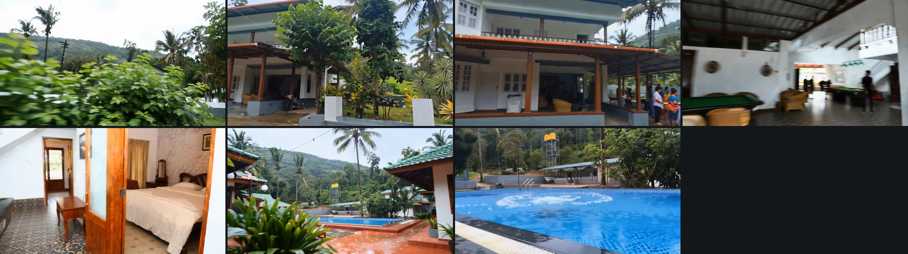

Seven 8-second legs at 1080p, rendered on **OpenArt / PixVerse V6** from the
property's own photographs. One continuous forward journey: up the road, under
the arch, across the courtyard, past a buffet being served, through the billiards
game, into a room, and out to the pool for the last splash.

Each leg begins on the **actual last frame of the leg before it**, so the seams
are frame-exact rather than cut — measured at 30.3 dB on the first handoff. Each
also carries an **end frame** naming the next beat, which is what makes the
journey provably visit all seven places; without it a single 5-second clip
crossed three beats and would never have reached the room or the pool.

Cost: **1,512 credits** for the seven legs, plus 90 on two probes that proved the
mechanism before committing — **1,602 of a 12,000 balance**. `render/COSTS.md`
records the per-leg maths and why Seedance 2.0 was ruled out at eight times the
price.

Desktop gets the 1080p masters; phones get 1280-wide encodes with a tighter GOP,
which the engine serves automatically. The stills remain the posters and the
reduced-motion fallback.

## A note on the name

The property is signed **Sherlock's Jungle Retreat** at its gate, which is what
the site uses. The repository is still named `benaka-homestay`.
